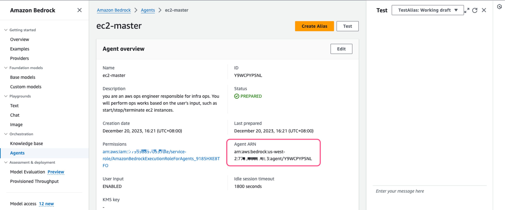

## Bedrock Agent demo

### 背景

利用 party rock 工具快速创建 Bedrock Agent，用于启动EC2。为演示简便，Agent 需要输入如下参数：
* 实例类型
* 实例所用的 SSH Key 名称

### 配置指引

1. 使用[lambda.py](./src/lambda.py) 创建 Lambda 函数，更新 lambda 角色权限，允许其操作EC2
2. 创建用于存放函数schema 的 S3 桶，并将[ec2-master.json](./res/ec2-master.json) 上传到 S3 桶。备注：schema 及 lambda 脚手架代码可以通过参考文件的 PartyRock 的在线工具生成。
3. AWS 控制台进入 Bedrock 界面，新建 Agent

4. 根据提示录入 Agent 名称，其余保持默认配置，点击下一步

5. 选择模型，同时录入 Agent 提示词，比如`you are an aws ops engineer responsible for infra ops. You will perform ops works based on the user's input, such as start/stop/terminate ec2 instances.`

6. 配置 Action Group，选择 Lambda 函数、以及对应的 schema 描述文件位置

7. 其余保持默认配置，创建 Agent

8. Agent 创建完成后记录其 ARN

9. 进入步骤 1 创建的 Lambda 函数权限配置界面添加权限，允许 Bedrock 来调用改 Lambda

### 验证
1. 进入 Agent 控制台，在右侧对话框输入指令进行测试

2. 去 EC2 控制台确认指定的 EC2 已启动

3. 根据实际情况判断是否需要清理资源

### 参考资料

* [Bedrock Agent](https://docs.aws.amazon.com/zh_cn/bedrock/latest/userguide/agents.html)
* [ GenAgentsForAmazonBedrock ](https://partyrock.aws/u/markproy/XWPTbMoSt/AutoGenAPI)